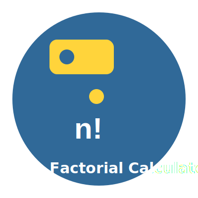

# 📊 Factorial Calculator - GUI Version using PySide6 & QtPy
---
[In python](https://github.com/mdriyadkhan585/Factorial-Calculator-in-Python)

[In C script](https://github.com/mdriyadkhan585/Factorial-Calculator-in-C)




---
Welcome to the **Factorial Calculator**! This is a simple GUI application built using **PySide6** and **QtPy** to calculate the factorial of any non-negative integer. It's easy to use, visually appealing, and perfect for those who want to explore recursion, factorials, and GUI development.

## ✨ Features
- 🧮 **Recursively computes factorials** for any non-negative integer.
- ❌ Handles invalid inputs, such as negative numbers or non-integer values, with error messages.
- 🎨 Clean and simple **graphical user interface** with white text on black background for input fields.
- 🔁 Supports multiple calculations without needing to restart the app.

## 💡 What is a Factorial?
The **factorial** of a non-negative integer `n` is the product of all positive integers less than or equal to `n`. It is denoted as `n!`. For example:
- `5! = 5 × 4 × 3 × 2 × 1 = 120`
- Special cases: `0! = 1` and `1! = 1`.

## 🖥️ Project Overview
This project is a graphical implementation of a factorial calculator that accepts user input through a text box, computes the factorial, and displays the result in the interface. Error messages are shown when invalid inputs (negative numbers or non-integers) are entered.

## 🎯 How to Use

### 1. Requirements:
- **Python 3.x** installed on your system.
- The following Python packages:
  ```bash
  pip install PySide6 qtpy
  ```

### 2. Running the Program:
1. **Clone or Download** this repository.
2. Open a terminal or command prompt and navigate to the directory where the code is saved.
3. Run the Python script with:
   ```bash
   git clone https://github.com/mdriyadkhan585/Factorial-Calculator-GUI
   cd Factorial-Calculator-GUI
   python factorial_calculator_gui.py
   ```

4. The graphical user interface (GUI) will appear, where you can enter a number and calculate its factorial.

### 3. Example Input and Output:
#### Valid Input:
- **Input**: `5`
- **Output**: `Factorial of 5 is: 120`
  
#### Invalid Input (Negative Number):
- **Input**: `-5`
- **Output**: `Error: Factorial of a negative number doesn't exist.`
  
#### Invalid Input (Non-integer):
- **Input**: `abc`
- **Output**: `Error: Please enter a valid integer.`

## 🛠️ Code Overview

### Main Components:
- **`QLineEdit` (Input Field)**: A text box where users can enter the number.
- **`QPushButton` (Button)**: Triggers the calculation of the factorial.
- **`QLabel` (Labels)**: Displays the result or error messages.
  
### Key Functionality:
- **Factorial Calculation**: The factorial is computed using a recursive function in Python. 
- **Input Validation**: Ensures that the user input is a valid, non-negative integer. Appropriate error messages are shown for invalid inputs.
- **GUI Layout**: The layout is managed using `QVBoxLayout`, which stacks the widgets vertically for a clean, user-friendly interface.

### Code Breakdown:

- **Factorial Calculation Function**:
  ```python
  def factorial(self, n):
      if n == 0 or n == 1:
          return 1
      else:
          return n * self.factorial(n - 1)
  ```

- **Input Validation and Error Handling**:
  The program checks if the input is a valid integer. If the input is not valid or is a negative number, it displays an appropriate error message:
  ```python
  def calculate_factorial(self):
      try:
          num = int(self.input_field.text())
          if num < 0:
              self.result_label.setText('Error: Factorial of a negative number doesn\'t exist.')
          else:
              result = self.factorial(num)
              self.result_label.setText(f'Factorial of {num} is: {result}')
      except ValueError:
          self.result_label.setText('Error: Please enter a valid integer.')
  ```

- **Input Box Style**:
  The text color of the input box has been customized to make it visually appealing:
  ```python
  self.input_field.setStyleSheet("color: white; background-color: black;")
  ```

## 📂 File Structure

```
Factorial-Calculator-GUI/
│
├── factorial_calculator_gui.py   # Main Python file containing the GUI code
└── README.md                     # This README file
```

## 🧑‍💻 Contributing
If you'd like to contribute or improve this project, feel free to open an issue or submit a pull request. Suggestions and feedback are always welcome!

## 📜 License
This project is licensed under the **MIT License**. See the `LICENSE` file for more information.

## 🎉 Acknowledgements
- Thanks to the **PySide6** and **QtPy** libraries for making Python GUI development easier!
- Python community for continuous support and improvement in the language and libraries.

---

### 🎯 Summary
This **Factorial Calculator** is a fun and interactive way to compute factorials using a simple yet elegant GUI. Whether you're learning Python or just need a tool to quickly calculate factorials, this project has got you covered. Enjoy coding! 😊

---
